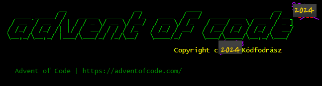

# Kodfodrasz.Advent-Of-Code-2024



<!--
<pre>
              __                 __           ____                  __
   ____ _____/ /   _____  ____  / /_   ____  / __/  _________  ____/ /__  2024
  / __ `/ __  / | / / _ \/ __ \/ __/  / __ \/ /_   / ___/ __ \/ __  / _ ]
 / /_/ / /_/ /| |/ /  __/ / / / /_   / /_/ / __/  / /__/ /_/ / /_/ /  __/
 \__,_/\__,_/ |___/\___/_/ /_/\__/   \____/_/     \___/\____/\__,_/\___/
 
                                           Copyright c 2024 Kódfodrász

  Advent of Code | https://adventofcode.com/
</pre>
-->

What is this? My solutions for the Advent of Code programming challenge in year 2024.
If you would like to know more about it, you can read about it here: <https://adventofcode.com/>


## It is that time of the year again...

... maybe this year I'll be patient enough to solve all the puzzles.

## Previous years

- https://gitlab.com/kodfodrasz/advent-of-code-2018
- https://gitlab.com/kodfodrasz/advent-of-code-2020
- https://github.com/kodfodrasz/advent-of-code-2022
- https://github.com/kodfodrasz/advent-of-code-2023

## How to run it?

### Compile it yourself

1. ensure you have at least [.Net SDK 9.0](https://dotnet.microsoft.com/en-us/download) installed
2. clone the repository
3. change directory to the cloned repository root
2. set two environment variables:
  - `AOC_DATA_DIR` to a directory path where the downloaded puzzle inputs will be cached.
  - `AOC_SESSION_COOKIE` is needed to download the puzzle inputs if not found in the cache. You can get it from your browser using web inspector after logging in to the AoC site.
3. `dotnet run -c Release --project .\Kodfodrasz.AoC.Cli\Kodfodrasz.AoC.Cli.fsproj`

### Run a precompiled version

No CI releases are planned now.

#### Compile a single file binary

This mostly a note to self at the moment

1. ensure you have at least [.Net SDK 9.0](https://dotnet.microsoft.com/en-us/download) installed
2. clone the repository
3. change directory to the cloned repository root
4. build a single file binary

    ```powershell
    # This example is for powershell
    # You may need to change the platform identifier [RID](https://learn.microsoft.com/en-us/dotnet/core/compatibility/sdk/9.0/rid-graph). 
    $target_rid="win-x64"
    dotnet publish -c Release `
      -f net9.0 -r $target_rid `
      --self-contained true `
      -p:PublishSingleFile=true `
      -p:EnableCompressionInSingleFile=true `
      -p:IncludeAllContentForSelfExtract=yes `
      .\Kodfodrasz.AoC.Cli\Kodfodrasz.AoC.Cli.fsproj

    $result_dir="Kodfodrasz.AoC.Cli\bin\Release\net9.0\$target_rid\publish\"
    echo "The binary is in $result_dir" 
    ```
5. You can now run the binary on another computer, and it doesn't need to have the relevant .Net Runtime/SDK installed!
   The environment variables `AOC_DATA_DIR` and `AOC_SESSION_COOKIE` mentioned above will still needed to be set up on the target machine

## TODO

There are lots of stuff missing from the library used to solve the puzzles.

- [x] CI

### Missing algorithms from the library

#### Memoization

- [ ] Memoization helper based on System.Runtime.Caching.MemoryCache

#### Array2D

- [ ] Transpose
- [ ] Rotate CW/CCW 90°, 180°
- [ ] Mirror X
- [ ] Mirror Y
- [ ] Sequential iterator by row
- [ ] Sequential iterator by column
- [ ] Extend in each dimension with default value
- [ ] Apply convolution matrix 3x3
- [ ] Apply convolution matrix 5x5

#### Handy comparison combinators

- [ ] Between (inclusive, exclusive, upper/lower inclusive)

#### String operations

Edit Distances:

- [ ] Hamming distance (same length)
- [ ] Lewenstein distance (any length)
- [ ] Longest Common Substring

#### Coordinate Systems / Metrics

- [ ] Manhattan distance
- [ ] Chebyshev distance
- [ ] Eucledian distance
- [ ] Haversine formula (great-circle distance on surface of a sphere)

#### Graph algorithms

Shortest path

- [ ] Dijkstra
- [ ] Floyd-Warschal
- [ ] Bellman-Ford (shortest path, generates all paths from one node as a byproduct)

Circle detection

- [ ] Floyd

Topological Sorting

- [ ] Kahn's algorithm

#### Lists

- [x] Shuffle

#### Sets

- [ ] Power set
- [ ] Cartesian product[^1]
- [ ] Cartesian product of single set on itself, except diagonal (Does this have a fancy name?)
- [ ] Cartesian product single set on itself, only top triangular matrix, except diagonal (Does this have a fancy name?)

#### Number Theory

- [x] Largest Common Denominator
- [x] Least Common Multiple
- [ ] Prime factorization
- [ ] Prime sequence generation
- [ ] Primality test
- [ ] Coprimality test

#### Combinatorics

- [ ] K-Combination
- [ ] Power set
- [ ] Binomial

#### Optimization

- [ ] Hungarian method
- [ ] Backtracking


[^1]: Magyarul/In Hungarian: Descartes-szorzat
